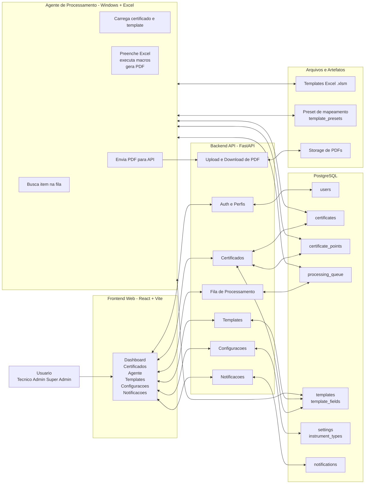
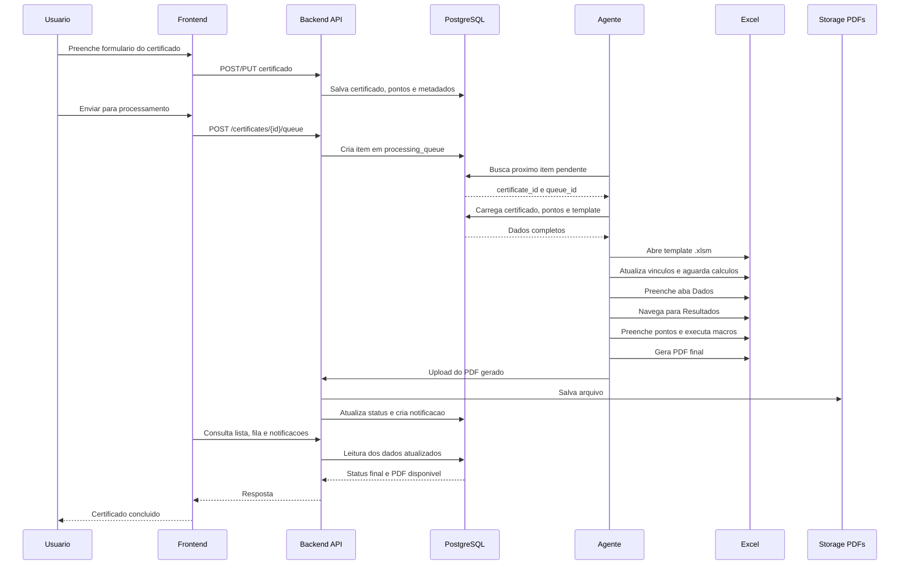
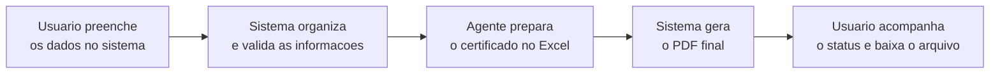

# Arquitetura da Solucao

Este desenho usa o nome **Agente** no lugar de `worker` ou `RPA`.

## Visao Geral

## Fluxo Principal

## Fluxo Simplificado

Um jeito mais leve de explicar a solucao para usuarios nao tecnicos:

### Como contar essa historia

1. O usuario preenche os dados do certificado em um formulario simples no sistema.
2. O sistema organiza essas informacoes e envia tudo para o Agente.
3. O Agente abre o modelo oficial do certificado e faz o preenchimento automaticamente.
4. O certificado e montado em PDF, pronto para consulta e download.
5. O usuario acompanha tudo pela tela, incluindo fila, notificacoes e resultado final.

## Versao Bem Ludica

Se quiser apresentar de forma ainda mais amigavel, pode usar esta leitura:

- **Pessoa**: informa os dados da calibracao no sistema.
- **Sistema**: junta, organiza e encaminha tudo.
- **Agente**: atua nos bastidores preparando o certificado automaticamente.
- **Resultado**: o PDF fica pronto e volta para a plataforma.
- **Acompanhamento**: o usuario recebe retorno visual do andamento e do documento final.

## Camadas

- **Frontend Web**: interface usada pelos perfis do sistema para cadastrar, acompanhar fila, baixar PDF e consultar notificacoes.
- **Backend API**: concentra autenticacao, regras de negocio, controle de acesso, fila, templates, configuracoes e persistencia.
- **Banco PostgreSQL**: guarda usuarios, certificados, pontos, fila, templates, configuracoes, instrumentos e notificacoes.
- **Agente**: processo Python executado em maquina Windows com Excel instalado, responsavel por transformar os dados do sistema em certificado PDF.
- **Excel e Templates**: planilhas `.xlsm` com macros e regras metrologicas usadas pelo Agente.
- **Storage de PDFs**: destino final dos certificados gerados para download no sistema.

## Nome sugerido para apresentar

Se quiser apresentar isso de forma mais comercial, eu sugiro este nome para o bloco do processamento:

- **Agente Inteligente de Emissao de Certificados**

Ou, mais curto:

- **Agente de Processamento**
